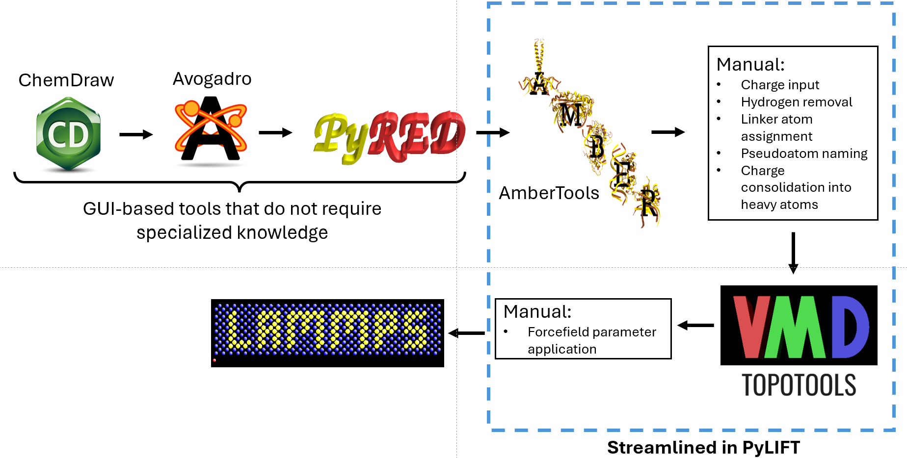

 

[](https://pylift-mit.readthedocs.io/en/latest/?badge=latest)


# PyLIFT
**Py**thon **L**AMMPS **I**ntegration **F**orcefield **T**ool is an open-source Python package designed to help facilatate the creation of LAMMPS input molecule files.

As a new package, documentation is still in the process of being created.
# Overview
### Capabilities
This package was born out of a desire to streamline the creation of LAMMPS input files. 

Current capabilities of PyLIFT include:

 - Read/write mol2 files into/out of a dictionary structure
 - Read GAFF/GAFF2 forcefield files from Amber
 - Read FRCMOD files from the AmberTools Antechamber program
 - Interface with TopoTools in VMD to create skeleton LAMMPS input files
 - Populate these LAMMPS files with forcefield data
 - Convert molecules to united-atom equivalents by consolidating hydrogen charges into their respective heavy atoms
 - Adapt forcefield naming conventions to united-atom (UA) identifiers
 - Prepare molecules for pseudopolymerization by assigning linker-atoms

### Why PyLIFT?
PyLIFT largely follows the methodology we slowly found to work from trial and error when we first set out to develop molecular dynamics capabilities within our group. PyLIFT was initially conceived as in-house code to allow others to focus on the science behind the work, rather than the repetitive and difficult to reproduce process of creating the files. 

Two of the largest challenges encountered were the numerous programs required, each with unique syntax, and the different types of files each program creates. PyLIFT removes both of these obstacles by:

1. High-level Python abstraction, allowing the user to stay within Python.
2. Conversion of files into Python dictionaries that can be easily read and written via PyLIFTs ability to generate JSON files.

PyLIFT is a single program that when starting from a mol2 file with defined charges, can create a LAMMPS input file.



### Why PyLIFT with pysimm?
[pysimm](https://pysimm.org/) is a simulation interface that can handle molecular dynamics, Monte Carlo, polymer generation, and polymer property predictions via interfacing with multiple other codes. One of the key benefits of pysimm is that most program-specific file formatting is handled on the backend with a LAMMPS input file being provided by the user. Thus, PyLIFT makes a concerted effort to create LAMMPS input scripts that can be readily used within pysimm. From a PyLIFT LAMMPS file, one can quickly polymerize with the Polymatic algorithm in pysimm and even perform hybrid MC/MD simulations, all within Python. 

To facilitate linking these PyLIFT with pysimm, PyLIFT is bundled into an in-house modified version of pysimm available here: https://github.com/bctapia/pysimm

# Getting Started
As a beta version, PyLIFT is currently unavailable via Conda or PIP. Currently, we recommend installing by downloading the GitHub repository:
```
git clone https://github.com/bctapia/PyLIFT
```
and then adding it to your PATH:
```
echo 'export PYTHONPATH=path/to/PyLIFT:$PYTHONPATH' >> ~/.bashrc
source ~/.bashrc
```
where you should modify ```/path/to/PyLIFT``` to where PyLIFT was downloaded. If you are not using a bash shell, then adding it to your PATH will be slightly different.

# Integration with VMD
To write skeleton LAMMPS input files, PyLIFT makes use of TopoTools available in [VMD](https://www.ks.uiuc.edu/Research/vmd/#:~:text=VMD%20is%20a%20molecular%20visualization,graphics%20and%20built-in%20scripting.) which is not prebundled into PyLIFT due to licensing restrictions. To integrate VMD into PyLIFT you will need to add the location of VMD to your PATH via:
```
echo 'export VMD_EXEC="/path/to/VMD_EXEC"' >> ~/.bashrc
source ~/.bashrc
```
where you should modify ```/path/to/VMD_EXEC``` to where VMD is located on your computer. If you are not using a bash shell, then adding it to your PATH will be slightly different. 

To check if PyLIFT can find VMD, you can run
```
from pylift import vmd
vmd.test_vmd_exec()
```
which will either confirm VMD can be found by PyLIFT or will provide further instructions on setting it up correctly. 
# What's Next?
PyLIFT is currently in pre-release and not all functionality is fully implemented. We welcome user support via the Pull Requests Issues taps in the GitHub PyLIFT repository.

#### Features in Development:
- Optional RDKit, OpenBabel, and/or PyMOL integration if a user wants to easily visualize molecules to identify linker atoms within PyLIFT
- Gaussian and/or PyRED communication to generate RESP charges within PyLIFT
- Reading charge information from a dimer
# Questions/Ideas/Concerns?
Please send me (Brandon Tapia) an email at bctapia@mit.edu !
# License
PyLIFT is covered under the MIT License. Please see the license file for further information.