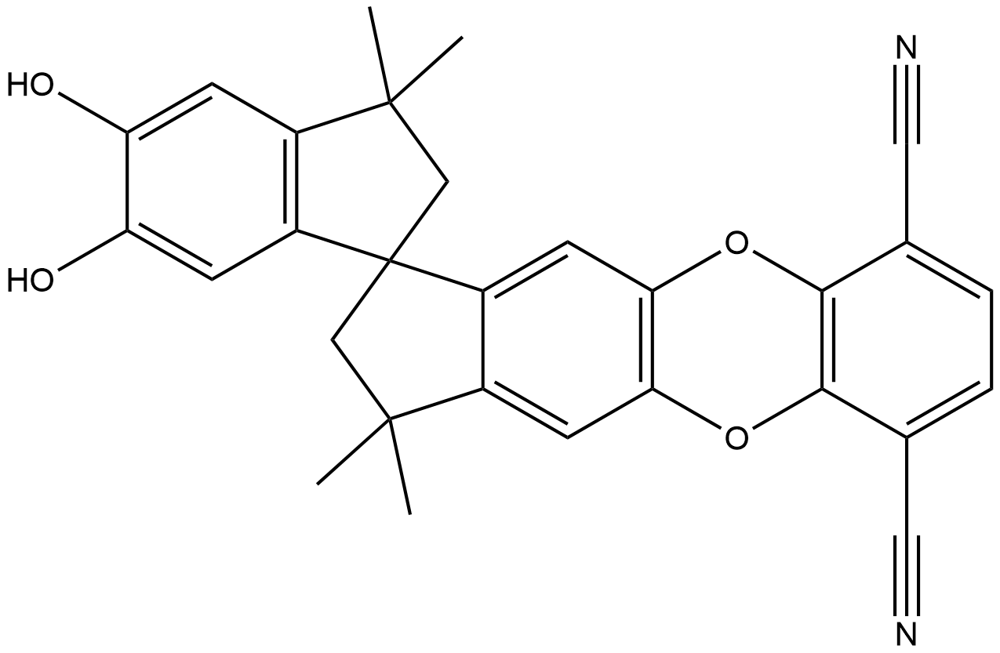
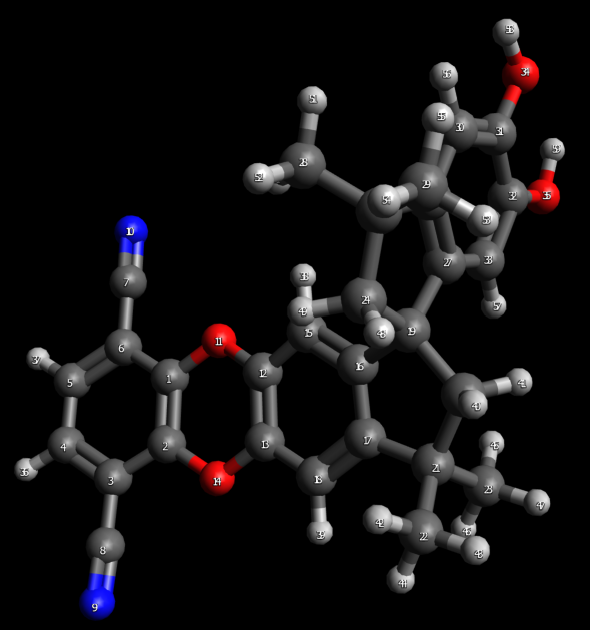

# All Atom Molecule Build
This tutorial covers how to use PyLIFT to build an all-atom LAMMPS input script for the polymer of intrinisic microporisity (PIM), PIM-1:

 
## Prerequisites
Before using PyLIFT we have to perform a couple of GUI-based tasks:
### 1. ChemDraw
 First, we need to generate a 2D molecule structure of the molecule we want to create. If this is a new molecule, you can build it in ChemDraw (or simila)
### 2. Avogadro (or similar)
We can now open the file in Avogadro. Because Avogadro read a 2D file, it may be in an unrealistic conformation. We can quickly adjust this using the toolbar: 
```
Extensions > Optimize geometry
```
 

This 3D PIM-1 can now be saved as both a MOL2 and PDB file.
### 3. PyRed
To generate accurate charges, you probably want to submit the PDB file you created to PyRed. This process might take a couple of days to generate the final MOL2 file. If you want you can either perform this step, or simply continue with the MOL2 file you generated in Avogadro and we will add less-accurate charge information.
## PyLIFT
Now, we are ready to use PyLIFT. First, we should open a new file in your favorite text editor and import the required modules from PyLIFT
```
from pylift import amber, reader, writer, vmd, utilities, builder
```
Next, we create a function so that all the commands are contained and can be performed easily.
```
def pipeline():
```
We need to generate the proper forcefield information for the molecule. I want to use the gaff2 forcefield so I will run the command:
```
amber.antechamber('PIM-1_monomer.mol2',
                  'PIM-1_monomer_Amber.mol2',
                   forcefield = 'gaff2',
                   charge_method = None,
                   missing_search = 'parmchk2')
```
This command reads in the MOL2 file either from PyRed (if used), or that was created in Avogadro. The MOL2 file that Amber will generate will be called ```CANAL-Me-Me2F_Amber.mol2```. If we used PyRed, then ```charge_method=None``` because charges were already determined. If we didn't use PyRed then we should specify ```charge_method=bcc``` which will calculate charges via the AM1-BCC method. Note: any other option charge option available in Antechamber could have also been used. The gaff2 forcefield may not have parameters that cover every required parameter. By specifying ```missing_search='parmchk2'```, we are using the ```parmchk2``` function available in Antechamber to provide replacement parameters which will be available in the ```missing_ff_params.frcmod``` file.

Antechamber has now provided ```CANAL-Me-Me2F_Amber.mol2``` containing the proper forcefield atom types. 
To allow PyLIFT to understand the molecule, we need to read it into PyLIFT as 
```
molecule = reader.read_mol2('CANAL-Me-Me2F_Amber.mol2')
```
Because I plan to use pysimm later to create a polymer from the monomer I am creating, I have to remove one hydrogen from each linking atom so that when the polymerization occurs, there is not an extra hydrogen attached.
From inspecting the molecule in Avogadro, we know that the linker atoms are atoms 4, 5, 34, and 35. Therefore I must remove those. By removing hydrogens, I am also adjusting the overall charge of the atom which I do not want to do. I instead want to uniformly redistribute the charge from each hydrogen I removed into the remaining molecule atoms. To do all this I run:
```
molecule = builder.remove_h(molecule, 
    specific_atoms=[4,5,34,35], 
    num_delete=[1,1,1,1],          
    charge_distribution='uniform',
    h_identifiers = ['h','H'])
```
Hydrogens are identified as any atom that starts with an 'h' or 'H' ```num_delete[i]``` atoms are removed from ```specific_atoms[i]```.
Next, because I am planning on polymerizing later, I need to be able to identify which atoms are linkers. By running:
```
molecule = builder.assign_linkers(molecule, 
    linker_atoms=[4,35], 
    linker_identifier='L')
``` 
I have now identified atoms 4 and 35 as the atoms I want to link together by adding an L in front of each atom type. Note: I do not need to assign '5' and '34' as linkers because Polymatic (available in pysimm) treats these differently. Regardless, if I wanted to assign them as linkers, PyLIFT would have no problem doing that.

In MOL2 files, atom types and atom names are different entities. Amber has added the forcefield information as atom types, however, I also want to make sure the atom names include the forcefield information to avoid confusion. Therefore, I run
```
molecule = builder.types_to_names(molecule)
```
To create a skeleton LAMMPS data file using TopoTools we need a MOL2 file containing all of our previous work which we generate by running
```
writer.write_mol2(molecule, 'PIM-1_forTopo.tmp.mol2')
```
I can now read the ```PIM-1_forTopo.tmp.mol2``` file using VMD and TopoTools.
```
vmd.topo_write('PIM-1_forTopo.tmp.mol2',
            'PIM-1_fromTopo.tmp.mol2', 
            bonds=True,
            angles=True,
            dihedrals=True,
            impropers=True,
            verbose=True)
```
This takes ```PIM-1_forTopo.tmp.mol2```, creates bonds, angles, dihedrals, and improper information and writes all of this to ```PIM-1_fromTopo.tmp.mol2```.

Now that I have a LAMMPS file, I need to read this new information back into PyLIFT dictionary:
```
molecule = reader.read_topo(pseudoatoms = False,
           input_file = 'PIM-1_fromTopo.tmp.mol2')
```
PyLIFT needs to understand the forcefield, which is available as a JSON file in PyLIFT in the ff_data folder
```
gaff2 = utilities.read_json('gaff2.json')
```
If we want to read in the original gaff2.dat file from Amber, see the ff_update tutorial. 
PyLIFT also needs the missing paramter FRCMOD file from Antechamebr
```
missing_params = reader.read_frcmod('missing_ff_params.frcmod')
```
We are now ready to add the forcefield information into the LAMMPS file:
```
molecule = builder.add_ff_params(molecule,
                                gaff2,
                                missing_params,
                                pseudoatoms=False, 
                                approx_match=True,
                                user_match=False,
                                verbose=True)
```
```molecule``` is our system, ```gaff2``` is the forcefield, and ```missing_params``` are the missing forcefield parameters. We set ```pseudoatoms=False``` because this is an all atom simulation. ```approx_match=True``` means that if we have some type of parameter (e.g., ```c3-c3-ca-c3```), PyLIFT will first look for a gaff2 parameter that matches ```c3-c3-ca-c3``` (or ```c3-ca-c3-c3```) but if that doesn't exist, PyLIFT will look for a gaff2 parameter that matches ```X-c3-ca-X``` (or ```X-ca-c3-X```) as ```X``` is used in Amber to denote any atom. ```user_match``` allows a user to specify any other approximate matches to search for. For example for the parameter ```c3-c3-cy-c3```,  ```X-c3-cy-X``` does not exist, but ```cy``` is just a ```c3``` atom in a square system, thefore if I specify ```user_match = {'cy': 'c3'}```, the system will also search for ```X-c3-c3-X```.

Outside of the function we can now write
```
if __name__ == '__main__':
    pipeline()
```
which means pipeline() will only run when I run the file from the command line. 

We can save the file as ```All_Atom_Tutorial.py``` and run the file in the terminal with ```python All_Atom_Tutoral.py```.